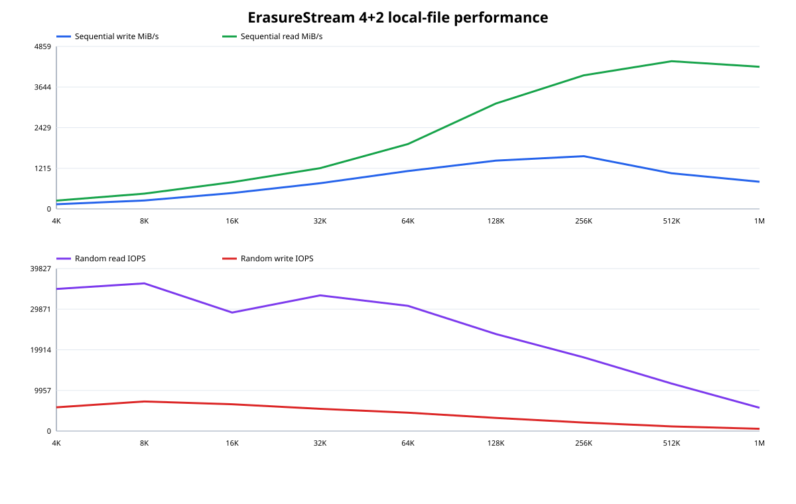
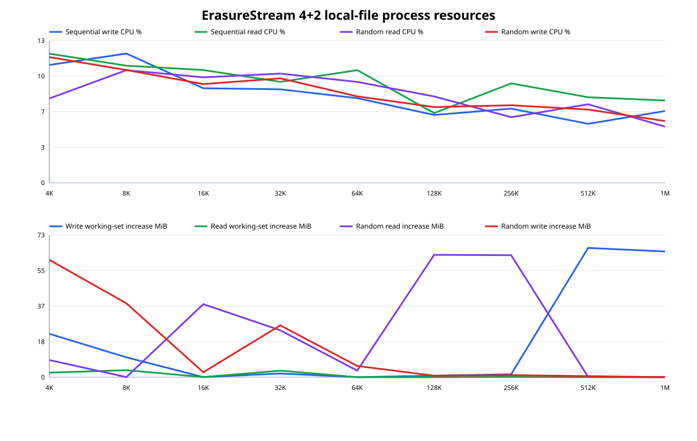

# ErasureStream 4+2 local-file block-size selection

Status: completed on 2026-08-26.

Source state: the uncommitted `ErasureStream` implementation, tests, benchmark
harness, and documentation described by this record. The repository also
contains unrelated in-progress user changes.

## Decision

`ErasureStreamOptions.DefaultBlockSize` is **128 KiB**.

This is the measured knee for a general-purpose default. Compared with 64 KiB,
128 KiB improved sequential write throughput by 27% and sequential read throughput
by 63%. Its costs were 23% lower random-read IOPS and 28% lower random-write IOPS.
Moving again to 256 KiB improved sequential write by another 9% and sequential
read by 27%, but reduced random-read IOPS by 24% and random-write IOPS by 35%. A caller expecting
almost exclusively large sequential transfers can therefore select 256 KiB or
larger explicitly; 128 KiB better preserves mixed-workload behavior.





## Method

The retained harness creates a self-describing 4+2 set over six local
`FileStream` instances. Each block size from 4 KiB through 1 MiB is measured in
powers of two against a 256 MiB logical stream. It measures:

- a complete sequential write and flush;
- a sequential read after closing and reopening all six files;
- 4,096 deterministic, queue-depth-one random 4 KiB reads; and
- 4,096 deterministic, queue-depth-one random 4 KiB writes.

Every phase starts with a newly opened `ErasureStream`. Process CPU time is
reported as a percentage of all 24 logical processors. Memory columns retain
the peak working-set increase during the phase and process-wide managed bytes
allocated. Ordinary sequential reads retain and prefetch the next block;
explicit random reads retain only the block they requested. The harness writes a machine-readable
[CSV](2026-08-26-erasure-stream-block-size.csv) and the two SVG charts above.

Command:

```text
dotnet run -c Release --no-build --no-restore \
  --project benchmarks/TeeForge.Benchmarks -- \
  --erasure-stream-files --data-mib 256 --random-operations 4096
```

## Environment

- Windows 11 build 26200
- AMD Ryzen 9 5900X, 12 physical / 24 logical cores
- Samsung SSD 990 PRO 2 TB NVMe, backing the local `C:` temporary directory
- .NET SDK 10.0.400; .NET runtime 10.0.11 x64
- Release build; 4 data members plus 2 parity members
- 64 MiB unified stream cache; one logical block of read-ahead

This is a warm-cache local-file comparison, not a durable-media benchmark.
Reopening the files clears the `ErasureStream` cache but does not evict the
Windows page cache. Flushes do not request device write-through. CPU power,
background activity, and OneDrive activity were not controlled. The phases run
in block-size order in one process, so shared `ArrayPool` retention can influence
the working-set deltas; managed allocation and I/O measurements remain in the
CSV for interpretation.

## Results

| Member block | Seq write MiB/s | Seq read MiB/s | Random read IOPS | Random write IOPS |
| ---: | ---: | ---: | ---: | ---: |
| 4 KiB | 139.7 | 247.0 | 34,832 | 5,815 |
| 8 KiB | 252.6 | 455.3 | 36,207 | 7,248 |
| 16 KiB | 474.7 | 799.3 | 29,049 | 6,563 |
| 32 KiB | 768.1 | 1,217.2 | 33,254 | 5,443 |
| 64 KiB | 1,132.9 | 1,938.8 | 30,699 | 4,503 |
| **128 KiB** | **1,443.0** | **3,150.6** | **23,784** | **3,221** |
| 256 KiB | 1,577.4 | 3,993.3 | 18,067 | 2,086 |
| 512 KiB | 1,065.7 | 4,417.1 | 11,642 | 1,145 |
| 1 MiB | 811.3 | 4,250.2 | 5,704 | 556 |

At 128 KiB the normalized CPU readings were 6.2% for sequential writes, 6.4%
for sequential reads, 7.9% for random reads, and 7.0% for random writes. Managed
allocation for those phases was 1.6, 1.0, 65.9, and 9.6 MiB respectively.
The full per-phase CPU and memory measurements are retained in the CSV rather
than rounded into this summary.

## Before/after optimization comparison

The second run replaced dictionary-wide eviction searches with an intrusive
second-chance queue, gave complete codeword overwrites a no-read fast path,
reused the per-entry asynchronous write fan-out storage, and immediately
released completed sequential codewords. Both runs used the method and machine
described above.

| Block | Metric | Before | After | Change |
| ---: | --- | ---: | ---: | ---: |
| 4 KiB | Sequential write | 28.0 MiB/s | 139.7 MiB/s | **4.99x** |
| 4 KiB | Sequential read | 35.4 MiB/s | 247.0 MiB/s | **6.99x** |
| 4 KiB | Random read, 4,096-operation sample | 40,004 IOPS | 34,832 IOPS | Inconclusive |
| 4 KiB | Random write | 4,239 IOPS | 5,815 IOPS | **1.37x** |
| 128 KiB | Sequential write | 953.2 MiB/s | 1,443.0 MiB/s | **1.51x** |
| 128 KiB | Sequential read | 2,360.6 MiB/s | 3,150.6 MiB/s | **1.33x** |
| 128 KiB | Random read | 19,489 IOPS | 23,784 IOPS | **1.22x** |
| 128 KiB | Random write | 2,969 IOPS | 3,221 IOPS | **1.08x** |

The 4 KiB sequential-write allocation fell from 1,815 MiB to 19.5 MiB and
sequential-read allocation from 2,392 MiB to 24.4 MiB. The isolated 4 KiB
random-read phase lasts only about 0.12 seconds and is sensitive to scheduler
and page-cache noise, so no regression is inferred from that sample; the longer
128 KiB result improved 22%.

## Interpretation

The optimized path shows that most of the former 4 KiB sequential penalty was
software overhead rather than Reed-Solomon arithmetic or storage bandwidth.
Small blocks still issue more member operations and synchronization. Large blocks
amortize that remaining overhead, but a 4 KiB random
write is a read/modify/write of all four data blocks plus two regenerated parity
blocks. That amplification becomes dominant beyond 128 KiB. Random reads also
eventually lose because a cache miss downloads a larger member block.

The default is a policy choice, not an on-disk requirement. The aligned header
records the chosen block size, and callers should override 128 KiB when their
remote-object size, storage stripe, latency, or workload distribution points to
a different value. The companion
[`RandomAccessMemoryStream` experiment](2026-08-26-erasure-stream-memory-block-size.md)
isolates coding and cache overhead and recommends 64 KiB for memory-backed or
random-write-heavy workloads.
