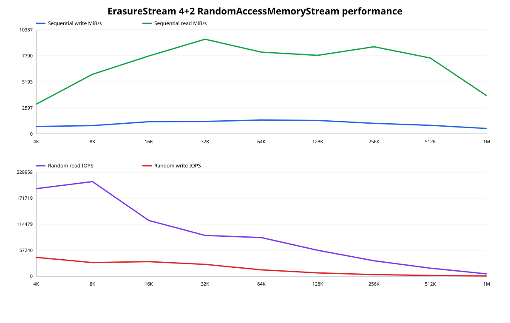
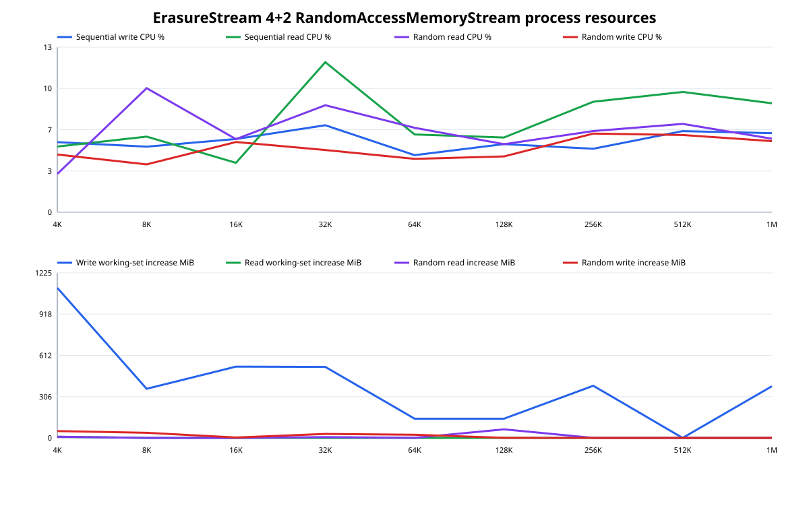

# ErasureStream 4+2 RandomAccessMemoryStream block sizes

Status: completed on 2026-08-26.

## Conclusion

The memory-backed run supports retaining **128 KiB** as the general,
file-oriented default, but identifies **64 KiB** as the better override for a
memory-backed or random-write-heavy set.

Against 64 KiB, 128 KiB was 3% slower for sequential writes, 4% slower for
sequential reads, 33% slower for random reads, and 48% slower for random writes.
At 256 KiB, sequential reads improved 11%, while sequential writes fell 22%,
random reads fell 40%, and random writes fell 51%.





## Method

The harness creates a self-describing 4+2 `ErasureStream` over six expandable
`RandomAccessMemoryStream` members. For every power-of-two member block from
4 KiB through 1 MiB it measures a 256 MiB logical stream using:

- one complete sequential write;
- a sequential read after disposing and reopening `ErasureStream` over the same
  six memory members;
- 4,096 deterministic queue-depth-one random 4 KiB reads; and
- 4,096 deterministic queue-depth-one random 4 KiB writes.

The unified stream cache is 64 MiB with one block of read-ahead for ordinary
`Stream.Read`. Explicit positional reads retain only their requested cache block
and do not fetch an unrequested neighbor. Member streams are disposed and a
blocking compacting collection is performed between block-size cases, outside
all timed phases.

Command:

```text
dotnet run -c Release --no-build --no-restore --project benchmarks/TeeForge.Benchmarks -- --erasure-stream-memory --data-mib 256 --random-operations 4096
```

The harness retains the complete machine-readable
[CSV](2026-08-26-erasure-stream-memory-block-size.csv). CPU is normalized over
24 logical processors. Working-set increases and process-wide managed allocation
are sampled with the same implementation as the local-file experiment.

## Environment and limitations

- Windows 11 build 26200
- AMD Ryzen 9 5900X, 12 physical / 24 logical cores
- .NET SDK 10.0.400; .NET runtime 10.0.11 x64
- Release build; 4 data members plus 2 parity members

This isolates the managed coding, copying, locking, task, and cache paths from
storage latency. It is not a prediction of disk, object-store, or network
throughput. Sequential-write allocation includes expansion of all six memory
members. `MemoryStream` growth copies successively larger backing arrays, so
allocated bytes are much larger than the final 384 MiB coded payload.

## Results

| Member block | Seq write MiB/s | Seq read MiB/s | Random read IOPS | Random write IOPS |
| ---: | ---: | ---: | ---: | ---: |
| 4 KiB | 735.1 | 2,953.1 | 192,566 | 41,484 |
| 8 KiB | 824.6 | 5,945.4 | 208,144 | 30,102 |
| 16 KiB | 1,212.6 | 7,770.0 | 122,684 | 32,119 |
| 32 KiB | 1,243.9 | 9,442.4 | 89,753 | 26,093 |
| **64 KiB** | **1,380.8** | **8,150.7** | **85,002** | **14,145** |
| 128 KiB | 1,339.0 | 7,836.1 | 57,103 | 7,393 |
| 256 KiB | 1,050.5 | 8,689.4 | 34,047 | 3,631 |
| 512 KiB | 850.4 | 7,567.2 | 17,783 | 1,676 |
| 1 MiB | 540.4 | 3,807.8 | 5,214 | 679 |

At 128 KiB the normalized CPU readings were 5.4% for sequential writes, 6.0%
for sequential reads, 5.4% for random reads, and 4.5% for random writes. Managed
allocation was 1,535.7, 0.3, 64.5, and 2.3 MiB respectively. The large
sequential-write allocation is predominantly member expansion rather than the
bounded erasure cache.

## Before/after optimization comparison

| Block | Metric | Before | After | Change |
| ---: | --- | ---: | ---: | ---: |
| 4 KiB | Sequential write | 67.6 MiB/s | 735.1 MiB/s | **10.88x** |
| 4 KiB | Sequential read | 66.2 MiB/s | 2,953.1 MiB/s | **44.64x** |
| 4 KiB | Random read (optimized seven-run median) | 434,234 IOPS | 413,943 IOPS | 0.95x* |
| 4 KiB | Random write | 15,638 IOPS | 41,484 IOPS | **2.65x** |
| 128 KiB | Sequential write | 1,055.5 MiB/s | 1,339.0 MiB/s | **1.27x** |
| 128 KiB | Sequential read | 4,966.3 MiB/s | 7,836.1 MiB/s | **1.58x** |
| 128 KiB | Random read | 40,647 IOPS | 57,103 IOPS | **1.40x** |
| 128 KiB | Random write | 7,042 IOPS | 7,393 IOPS | **1.05x** |

At 4 KiB, sequential-write allocation fell 54% and sequential-read allocation
fell 99.7%. The 4 KiB random-read phase lasts about 0.02 seconds in the optimized
run, so its before/after IOPS ratio is not statistically useful at only 4,096
operations. The longer 128 KiB phase improved 40%. The retained numbers are a
single-run engineering comparison rather than confidence intervals.

### 4 KiB random-read verification

The suspicious 192,566 IOPS result was checked with seven fresh-process trials
of 262,144 random reads each. The optimized implementation produced a median of
**413,943 IOPS**, a mean of **397,415 IOPS**, and a range of **334,326–444,912
IOPS**. The original 434,234 IOPS observation is inside that range. There is
therefore no measured 0.44x regression; the two 4,096-operation observations
were too short to compare.

The [individual-run CSV](2026-08-26-erasure-stream-memory-4k-random-read-reruns-raw.csv)
retains provenance and every measured field. The matching
[aggregate CSV](2026-08-26-erasure-stream-memory-4k-random-read-reruns-aggregate.csv)
retains mean, median, range, and sample standard deviation for every metric. The
new `--block-size` harness option makes the focused experiment reproducible:

```text
dotnet run -c Release --no-build --no-restore \
  --project benchmarks/TeeForge.Benchmarks -- \
  --erasure-stream-memory --block-size 4096 \
  --data-mib 256 --random-operations 262144
```

\* The 0.95x figure compares the old short single observation with the optimized
seven-run median. It is shown to replace the incorrect 0.44x value, but it is
not an equivalent-protocol before/after result under the repository-wide policy.

## Interpretation

Removing the cache scan, old-data reads, and per-codeword task allocations makes
the former per-operation overhead at 4 KiB and 8 KiB especially visible in the
before/after ratios. Sequential throughput now reaches a broad plateau at
16–256 KiB. Random writes
peak at 16–32 KiB and then decline with read/modify/write amplification.

The 64 MiB cache also explains the random-read shape. Small requested blocks
allow most of the deterministic working set to remain resident. Once the
working set exceeds the cache, larger misses copy proportionally more memory.
The cache retains exactly the blocks requested by `ReadAt`; ordinary stream
reads separately retain and prefetch their next block.
